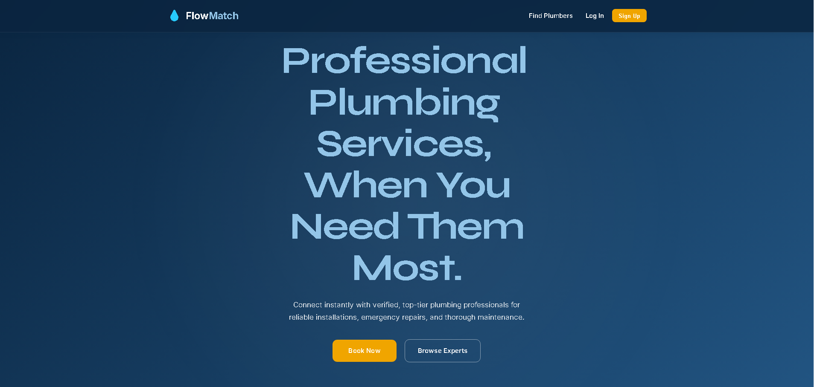

<a name="top"></a>


<p align="center">
  <a href="https://git.io/typing-svg">
    
  </a>
</p>

<p align="center">
  
  
  
  
  
  
</p>

<p align="center">
  
  
  
  
  
  
  
</p>

---

## 📋 Table of Contents

| Section | Description |
|---------|-------------|
| [✨ Overview](#-overview) | What FlowMatch is & why it exists |
| [🎯 Features](#-features) | Complete feature breakdown |
| [🏗️ Architecture](#️-architecture) | System design & data flow |
| [💻 Tech Stack](#-tech-stack) | All technologies used |
| [📁 Project Structure](#-project-structure) | Full folder tree |
| [⚡ Quick Start](#-quick-start) | Get running in 5 minutes |
| [🔧 Installation](#-installation) | Detailed setup guide |
| [🌍 Environment Variables](#-environment-variables) | Config reference |
| [📡 API Reference](#-api-reference) | Endpoints & usage |
| [📸 Screenshots](#-screenshots) | Visual preview |
| [🗺️ Roadmap](#️-roadmap) | What's coming next |
| [🤝 Contributing](#-contributing) | How to contribute |
| [👤 Author](#-author) | About the developer |
| [📄 License](#-license) | License info |


## ✨ Overview

**FlowMatch** is a full-stack plumber booking platform built on the MERN stack that connects homeowners with verified plumbing professionals. Customers can search, filter, and book plumbers by specialty, view real-time ratings, and track booking status through a polished dashboard. Plumbers manage incoming jobs with accept/decline/complete workflows, while administrators oversee the entire ecosystem through a dedicated admin panel with user, booking, review, and category management.

The frontend delivers a premium experience powered by **React 19**, **Framer Motion**, and **GSAP ScrollTrigger** — featuring cinematic page transitions, parallax hero sections, and micro-interactions throughout. The backend is a hardened **Express 5** REST API secured with JWT authentication, role-based access control, bcrypt password hashing, and SMTP-based password recovery.

<p align="center">
  
  <br/><em>🖼️ FlowMatch — Premium Plumber Booking Portal</em>
</p>


## 🎯 Features

<table>
<tr>
<td width="50%">

### 🔐 Authentication & Security
- JWT-based stateless authentication
- Role-based access: **Customer**, **Plumber**, **Admin**
- Bcrypt password hashing (bcryptjs)
- Forgot / Reset password via 6-digit OTP (SHA-256 hashed, 10-min expiry)
- Token-based password reset (`/reset-password/:token`)
- Protected API routes with middleware guards
- CORS whitelist with origin validation
- Global 401 interceptor with auto-redirect to login

</td>
<td width="50%">

### 🚿 Booking System
- Search & filter plumbers by area, rating, category
- Real-time cost preview based on hourly rate
- Full booking lifecycle: Pending → Accepted → Completed / Cancelled
- Validated status transitions (e.g., completed → no further changes)
- Booking detail view with visual status timeline
- Interactive Leaflet map with customer/plumber markers
- OSRM routing with car/bike/walk travel time estimates
- Role-specific dashboards (Customer vs Plumber)
- Cancel/decline workflows with confirmation modals

</td>
</tr>
<tr>
<td width="50%">

### ⭐ Reviews & Ratings
- Post-completion star rating (1–5) with comments
- Dynamic plumber rating aggregation (MongoDB aggregation pipeline)
- Public plumber profile with review history
- Paginated review loading (load more)
- Interactive hover-to-rate star component
- Recent reviews API for dynamic homepage testimonials
- One-review-per-booking enforcement (unique index)

</td>
<td width="50%">

### ⚡ Performance & UX
- Vite 8 with lightning-fast HMR
- Code splitting per route (`React.lazy`)
- Lenis smooth scrolling engine
- GSAP ScrollTrigger parallax animations
- Framer Motion page transitions with blur
- Skeleton loaders for all async states

</td>
</tr>
<tr>
<td width="50%">

### 👤 User Profiles
- Avatar upload with live preview (Multer)
- Editable profile: name, phone, area, bio
- Plumber-specific: experience, hourly rate, services
- Profile completeness progress bar
- Multi-step registration with category selection

</td>
<td width="50%">

### 🛡️ Admin Dashboard
- Full CRUD: Users, Bookings, Reviews, Categories
- Tabbed interface with server-side paginated data tables
- Category management (create / update / delete)
- User management (view / edit / delete with cascade)
- Cascade deletion: removing a user purges associated bookings & reviews
- Danger-zone deletion with confirmation modals
- Real-time status badges across all entities
- Safe null-reference handling for deleted user references

</td>
</tr>
<tr>
<td width="50%">

### 🔧 Plumber Premium Dashboard
- Industrial-precision dark-mode sidebar layout
- Animated stat cards (Today's Jobs, Pending, Active, Completed)
- Tabbed job filters: All · Pending · In Progress · Completed · Cancelled
- Slide-out Job Detail Drawer with full customer info
- Background polling every 30s for live job updates
- useMemo/useCallback optimized — zero re-render lag

</td>
<td width="50%">

### 📧 Email Notifications
- Customer notified on booking Accepted / Declined / Completed
- Plumber notified when a new review is submitted
- Reusable `generateEmailTemplate()` HTML generator
- Table-based layout — Gmail, Outlook & Apple Mail safe
- Status-aware color badges (green / red / blue)
- Inline styles only — no external CSS, no JS

</td>
</tr>
</table>


## 🏗️ Architecture

### System Architecture

<p align="center">
  
</p>

### Request Flow

<p align="center">
  
</p>


## 💻 Tech Stack

### Frontend
<p align="center">
  <a href="https://skillicons.dev">
    
  </a>
</p>

### Backend
<p align="center">
  <a href="https://skillicons.dev">
    
  </a>
</p>

| Category | Technology | Version | Purpose |
|----------|-----------|---------|---------|
| **Frontend** | React | 19.2 | UI component framework |
| **Frontend** | Vite | 8.0 | Build tool & dev server |
| **Frontend** | Framer Motion | 12.38 | Page transitions & animations |
| **Frontend** | GSAP | 3.14 | ScrollTrigger parallax effects |
| **Frontend** | @gsap/react | 2.1 | GSAP React integration hooks |
| **Frontend** | Lenis | 1.3 | Smooth scroll engine |
| **Frontend** | React Router DOM | 7.14 | Client-side routing |
| **Frontend** | Axios | 1.15 | HTTP client |
| **Frontend** | React Intersection Observer | 10.0 | Viewport detection |
| **Frontend** | Leaflet | 1.9 | Interactive map rendering |
| **Frontend** | React-Leaflet | 5.0 | React bindings for Leaflet |
| **Backend** | Node.js + Express | 5.2 | REST API server |
| **Backend** | Mongoose | 9.4 | MongoDB ODM |
| **Backend** | JSON Web Token | 9.0 | Stateless authentication |
| **Backend** | Bcryptjs | 3.0 | Password hashing |
| **Backend** | Multer | 2.1 | File upload handling |
| **Backend** | Nodemailer | 8.0 | SMTP email delivery |
| **Backend** | CORS | 2.8 | Cross-origin resource sharing |
| **Backend** | Dotenv | 17.4 | Environment variables |
| **Database** | MongoDB | 7.x | Document database |


## 📁 Project Structure

```
📦 FlowMatch
├── 📂 frontend/
│   ├── 📂 src/
│   │   ├── 📂 components/          # 15 reusable UI components
│   │   │   ├── Navbar.jsx          # Scroll-aware sticky navigation
│   │   │   ├── Footer.jsx          # Site-wide footer
│   │   │   ├── DashboardLayout.jsx # Sidebar + content grid layout
│   │   │   ├── PlumberLayout.jsx   # Premium sidebar layout for plumber role
│   │   │   ├── PageWrapper.jsx     # Framer Motion page transitions
│   │   │   ├── BookingMap.jsx      # Leaflet map + OSRM routing
│   │   │   ├── Toast.jsx           # Portal-based notification system
│   │   │   ├── ConfirmModal.jsx    # Danger-action confirmation dialog
│   │   │   ├── SkeletonLoader.jsx  # Shimmer loading placeholders
│   │   │   ├── StatusBadge.jsx     # Color-coded status pills
│   │   │   ├── ReviewCard.jsx      # Star rating display card
│   │   │   ├── ReviewForm.jsx      # Interactive star rating form
│   │   │   ├── EmptyState.jsx      # Friendly empty data messaging
│   │   │   ├── ErrorState.jsx      # Error with retry action
│   │   │   └── ErrorBoundary.jsx   # React error boundary wrapper
│   │   ├── 📂 pages/               # 16 route-level pages
│   │   │   ├── Home.jsx            # Hero + How It Works + Services + Dynamic Reviews
│   │   │   ├── Login.jsx           # Split-layout authentication
│   │   │   ├── Register.jsx        # Multi-step registration wizard
│   │   │   ├── ForgotPassword.jsx  # Email-based password recovery
│   │   │   ├── ResetPassword.jsx   # Token-based password reset
│   │   │   ├── PlumberList.jsx     # Searchable plumber directory
│   │   │   ├── PlumberProfile.jsx  # Detailed plumber profile + reviews
│   │   │   ├── BookingForm.jsx     # Service booking with cost preview
│   │   │   ├── Confirmation.jsx    # Post-booking success screen
│   │   │   ├── BookingDetail.jsx   # Status timeline + actions
│   │   │   ├── CustomerDashboard   # Stats + booking table
│   │   │   ├── PlumberDashboard    # Tabbed jobs + stat cards + drawer
│   │   │   ├── PlumberProfileSettings.jsx # Plumber-specific settings UI
│   │   │   ├── PlumberReviews.jsx  # Reviews page with star distribution chart
│   │   │   ├── AdminDashboard.jsx  # Full CRUD admin panel
│   │   │   └── Profile.jsx         # User profile editor + avatar
│   │   ├── 📂 services/            # API service layer (Axios)
│   │   │   ├── api.js              # Base Axios instance + interceptors
│   │   │   ├── authService.js      # Login, register, forgot/reset
│   │   │   ├── bookingService.js   # CRUD bookings
│   │   │   ├── plumberService.js   # Plumber directory queries
│   │   │   ├── reviewService.js    # Create & fetch reviews
│   │   │   ├── categoryService.js  # Category listing
│   │   │   ├── userService.js      # Profile update + avatar upload
│   │   │   ├── adminService.js     # Admin CRUD operations
│   │   │   └── apiError.js         # Centralized error handling
│   │   ├── 📂 context/             # React Context API
│   │   │   └── AuthContext.jsx     # Auth state + JWT persistence
│   │   ├── 📂 routes/              # Route protection
│   │   │   └── ProtectedRoute.jsx  # Auth-gated route wrapper
│   │   ├── 📂 styles/              # Design system
│   │   │   ├── tokens.css          # Global design tokens (colors, spacing)
│   │   │   └── plumber-tokens.css  # Plumber-role theme tokens
│   │   ├── 📂 utils/               # Utility functions
│   │   │   └── format.js           # Date, currency, status helpers
│   │   ├── 📂 assets/              # Static assets (hero.png, SVGs)
│   │   ├── App.jsx                 # Root component + route config
│   │   ├── App.css                 # App-level styles
│   │   ├── main.jsx                # Entry point + Lenis scroll
│   │   └── index.css               # Global styles + base components
│   ├── 📂 public/                  # Favicon, logo, icons
│   ├── index.html                  # HTML entry with SEO meta + Leaflet CSS
│   ├── vite.config.js              # Vite configuration
│   └── package.json                # Frontend dependencies
│
├── 📂 backend/
│   ├── 📂 src/
│   │   ├── 📂 controllers/         # Request handlers
│   │   │   ├── authController.js   # Register, login, password reset
│   │   │   ├── bookingController   # Create, list, status update
│   │   │   ├── plumberController   # Search & profile endpoints
│   │   │   ├── reviewController.js # Create & list reviews
│   │   │   ├── categoryController  # Category CRUD
│   │   │   ├── userController.js   # Profile & avatar management
│   │   │   └── adminController.js  # Admin-only operations
│   │   ├── 📂 routes/              # API route definitions
│   │   │   ├── authRoutes.js       # /api/auth/*
│   │   │   ├── bookingRoutes.js    # /api/bookings/*
│   │   │   ├── plumberRoutes.js    # /api/plumbers/*
│   │   │   ├── reviewRoutes.js     # /api/reviews/*
│   │   │   ├── categoryRoutes.js   # /api/categories/*
│   │   │   ├── userRoutes.js       # /api/users/*
│   │   │   └── adminRoutes.js      # /api/admin/*
│   │   ├── 📂 models/              # Mongoose schemas
│   │   │   ├── User.js             # Customer/Plumber/Admin model
│   │   │   ├── Booking.js          # Booking with status workflow
│   │   │   ├── Review.js           # Star rating + comment model
│   │   │   └── Category.js         # Service category model
│   │   ├── 📂 middleware/           # Express middleware
│   │   │   ├── authMiddleware.js   # JWT verify + role authorization
│   │   │   ├── adminMiddleware.js  # Admin-only gate
│   │   │   ├── errorMiddleware.js  # Global error handler
│   │   │   └── uploadMiddleware.js # Multer file upload config
│   │   ├── 📂 utils/               # Helper utilities
│   │   │   ├── generateToken.js    # JWT token generation
│   │   │   ├── httpError.js        # Custom HTTP error factory
│   │   │   ├── sanitizeUser.js     # Strip sensitive user fields
│   │   │   ├── sendEmail.js        # Nodemailer SMTP wrapper
│   │   │   └── emailTemplates.js   # Reusable HTML email template generator
│   │   ├── 📂 scripts/             # CLI utilities
│   │   │   ├── createAdmin.js      # Seed admin user
│   │   │   ├── seedCategories.js   # Seed default categories
│   │   │   └── smokeTest.js        # API smoke test suite
│   │   ├── 📂 config/              # Configuration
│   │   │   └── db.js               # MongoDB connection
│   │   └── server.js               # Express app entry point
│   ├── 📂 uploads/                 # Avatar file storage
│   ├── .env.example                # Environment variable template
│   └── package.json                # Backend dependencies
│
└── 📂 Database/                    # Local MongoDB data directory
```


## ⚡ Quick Start

> Get the app running locally in under 5 minutes

```bash
# 1. Clone the repository
git clone https://github.com/Joylan9/Plumber-booking-portal.git
cd Plumber-booking-portal/plumber

# 2. Install backend dependencies
cd backend
npm install

# 3. Configure backend environment
cp .env.example .env
# Edit .env to add your MongoDB URI and JWT secret

# 4. Start backend development server
npm run dev
# Server runs on http://localhost:5000
```

```bash
# 5. Open a new terminal window
cd ../frontend

# 6. Install frontend dependencies
npm install

# 7. Start frontend development server
npm run dev
# App runs on http://localhost:5173
```


## 🔧 Installation

### Prerequisites

| Tool | Version | Download |
|------|---------|----------|
| Node.js | ≥ 20.x | [nodejs.org](https://nodejs.org) |
| npm | ≥ 10.x | included with Node |
| MongoDB | ≥ 7.x | [mongodb.com](https://www.mongodb.com/try/download/community) |

### Database Seeding

To quickly populate your local MongoDB with default service categories and an admin user, run these scripts from the `backend` directory:

```bash
# Seed default plumbing categories (General, Heating, Drainage, etc.)
npm run seed:categories

# To create a default Admin user, run:
node src/scripts/createAdmin.js

# Run API smoke tests against a running backend:
npm run smoke:test
```


## 🌍 Environment Variables

> ⚠️ Never commit your `.env` file. Use `.env.example` as a reference.

Create a `.env` file in the `backend/` directory with the following variables:

| Variable | Required | Example | Description |
|----------|----------|---------|-------------|
| `PORT` | ❌ No | `5000` | Backend server port |
| `MONGODB_URI` | ✅ Yes | `mongodb://localhost:27017/flowmatch` | Connection string for MongoDB |
| `MONGO_URI` | ❌ No | `mongodb://localhost:27017/flowmatch` | Alias for `MONGODB_URI` (either works) |
| `JWT_SECRET` | ✅ Yes | `your_super_secret_jwt_key` | Secret used to sign JWT tokens |
| `FRONTEND_URL` | ✅ Yes | `http://localhost:5173` | Allowed CORS origin (comma-separated for multiple) |
| `SMTP_HOST` | ❌ No | `smtp.gmail.com` | Email provider SMTP host |
| `SMTP_PORT` | ❌ No | `587` | Email provider SMTP port |
| `SMTP_EMAIL` | ❌ No | `youremail@gmail.com` | Sender email address |
| `SMTP_PASSWORD` | ❌ No | `your_app_password` | Email app password |
| `FROM_EMAIL` | ❌ No | `noreply@flowmatch.com` | Sender alias email |
| `FROM_NAME` | ❌ No | `FlowMatch` | Sender alias name |
| `ENABLE_DEV_EMAIL_LOGS`| ❌ No | `true` | Log emails to console instead of sending |
| `SMOKE_BASE_URL` | ❌ No | `http://localhost:5000` | Base URL for the smoke test suite |

The frontend uses an optional `VITE_API_URL` environment variable to configure the backend base URL. If not set, it defaults to `http://localhost:5000`.

*(Note: The frontend connects to the backend via the Axios `baseURL` in `src/services/api.js` — there is no Vite proxy configured).*


## 📡 API Reference

Below are the core REST API endpoints. All protected routes require a `Bearer <JWT_TOKEN>` in the Authorization header.

### Authentication (`/api/auth`)
| Method | Endpoint | Auth | Description |
|--------|----------|------|-------------|
| `POST` | `/register` | ❌ | Register a new user (customer/plumber) |
| `POST` | `/login` | ❌ | Authenticate user & get token |
| `POST` | `/forgot-password`| ❌ | Request password reset OTP via email |
| `POST` | `/reset-password` | ❌ | Reset password via OTP |
| `POST` | `/reset-password/:token` | ❌ | Reset password via URL token |
| `PUT`  | `/reset-password/:token` | ❌ | Reset password via URL token (alias) |

### Users & Profiles (`/api/users`)
| Method | Endpoint | Auth | Description |
|--------|----------|------|-------------|
| `PUT`  | `/profile` | ✅ JWT | Update user profile details |
| `POST` | `/upload-avatar` | ✅ JWT | Upload user profile picture |

### Plumbers (`/api/plumbers`)
| Method | Endpoint | Auth | Description |
|--------|----------|------|-------------|
| `GET`  | `/` | ❌ | List all plumbers (supports filters) |
| `GET`  | `/:id` | ❌ | Get single plumber profile & reviews |

### Bookings (`/api/bookings`)
| Method | Endpoint | Auth | Description |
|--------|----------|------|-------------|
| `POST` | `/` | ✅ JWT (Customer) | Create a new booking request |
| `GET`  | `/` | ✅ JWT | Get bookings for current user |
| `GET`  | `/my-bookings` | ✅ JWT | Get bookings for current user (alias) |
| `GET`  | `/:id` | ✅ JWT | Get specific booking details |
| `PUT`  | `/:id/status` | ✅ JWT (Plumber/Admin) | Accept, decline, or complete booking |
| `PATCH`| `/:id/status` | ✅ JWT (Plumber/Admin) | Accept, decline, or complete booking (alias) |

### Categories (`/api/categories`)
| Method | Endpoint | Auth | Description |
|--------|----------|------|-------------|
| `GET`  | `/` | ❌ | List all service categories |
| `POST` | `/` | ✅ JWT (Admin) | Create a new service category |

### Reviews (`/api/reviews`)
| Method | Endpoint | Auth | Description |
|--------|----------|------|-------------|
| `GET`  | `/recent` | ❌ | Get recent reviews (default limit: 6) |
| `POST` | `/` | ✅ JWT (Customer) | Submit a review for a completed booking |
| `GET`  | `/plumber/:plumberId` | ❌ | Get paginated reviews for a plumber |

### Admin (`/api/admin`)
| Method | Endpoint | Auth | Description |
|--------|----------|------|-------------|
| `GET`  | `/users` | ✅ JWT (Admin) | List all registered users (paginated, filterable by role) |
| `GET`  | `/users/:id` | ✅ JWT (Admin) | Get a single user by ID |
| `PUT`  | `/users/:id` | ✅ JWT (Admin) | Update a user's profile fields |
| `DELETE`| `/users/:id` | ✅ JWT (Admin) | Delete a user (cascades bookings & reviews) |
| `GET`  | `/bookings` | ✅ JWT (Admin) | List all platform bookings (paginated) |
| `GET`  | `/bookings/:id` | ✅ JWT (Admin) | Get a single booking by ID |
| `DELETE`| `/bookings/:id` | ✅ JWT (Admin) | Delete a booking |
| `GET`  | `/reviews` | ✅ JWT (Admin) | List all user reviews (paginated) |
| `DELETE`| `/reviews/:id` | ✅ JWT (Admin) | Delete a review (recalculates plumber rating) |
| `GET`  | `/categories` | ✅ JWT (Admin) | List all categories |
| `POST` | `/categories` | ✅ JWT (Admin) | Create a new category |
| `PUT`  | `/categories/:id` | ✅ JWT (Admin) | Update a category |
| `DELETE`| `/categories/:id` | ✅ JWT (Admin) | Delete a category |

<details>
<summary>📥 POST /api/bookings — Example Request & Response</summary>

**Request Body:**
```json
{
  "plumberId": "60d5ecb8b392d7001532f123",
  "serviceType": "Emergency Plumbing",
  "date": "2024-06-15",
  "time": "10:00 AM",
  "address": "123 Main St, Springfield",
  "issueDescription": "Pipe burst in the kitchen, flooding the floor.",
  "notes": "Please bring extra towels."
}
```

**Response (201 Created):**
```json
{
  "success": true,
  "data": {
    "_id": "60d5eccfb392d7001532f124",
    "customerId": { "_id": "60d5ec12b392d7001532f120", "name": "John Doe", "email": "john@example.com" },
    "plumberId": { "_id": "60d5ecb8b392d7001532f123", "name": "Mike Smith", "email": "mike@example.com" },
    "serviceType": "Emergency Plumbing",
    "date": "2024-06-15T00:00:00.000Z",
    "time": "10:00 AM",
    "address": "123 Main St, Springfield",
    "issueDescription": "Pipe burst in the kitchen, flooding the floor.",
    "status": "pending",
    "createdAt": "2024-05-20T10:30:00.000Z"
  },
  "message": "Booking created successfully"
}
```
</details>


## 📸 Screenshots

<div align="center">
  
  <br/><em>🖼️ FlowMatch — Homepage Hero · Professional Plumbing Services, When You Need Them Most</em>
</div>


## 🗺️ Roadmap

- [x] ✅ JWT Authentication & Role Management
- [x] ✅ Plumber Directory & Public Profiles
- [x] ✅ Booking Workflow (Pending → Accepted → Completed)
- [x] ✅ Admin Dashboard (Full CRUD)
- [x] ✅ Review & Rating System
- [x] ✅ Plumber Premium Dashboard (Tabbed UI, Stat Cards, Job Drawer)
- [x] ✅ Email Notifications (Booking Status + New Review alerts)
- [x] ✅ Premium HTML Email Templates (cross-client compatible)
- [x] ✅ Interactive Booking Map (Leaflet + OSRM routing with car/bike/walk modes)
- [x] ✅ Dynamic Client Reviews on Homepage (auto-refreshing every 30s)
- [x] ✅ Admin Cascade Deletion (user removal purges bookings & reviews)
- [x] ✅ Full Admin Category CRUD (create / update / delete)
- [ ] 🔄 Real-time chat between Customer & Plumber (Socket.io)
- [ ] 🔄 Payment Gateway Integration (Stripe)
- [ ] 🔄 Push Notifications for booking updates
- [ ] 💡 Geolocation & Map-based Plumber Search
- [ ] 💡 AI-powered issue diagnosis chatbot


## 🤝 Contributing

Contributions are welcome and appreciated! Here's how you can help improve FlowMatch:

```bash
# 1. Fork the repository
# 2. Create your feature branch
git checkout -b feature/AmazingFeature

# 3. Commit your changes
git commit -m 'feat: Add AmazingFeature'

# 4. Push to the branch
git push origin feature/AmazingFeature

# 5. Open a Pull Request
```

### Commit Convention

| Prefix | Usage |
|--------|-------|
| `feat:` | New feature |
| `fix:` | Bug fix |
| `docs:` | Documentation changes |
| `style:` | Code formatting / CSS updates |
| `refactor:` | Code restructure (no new features/fixes) |
| `test:` | Adding or updating tests |
| `chore:` | Build tasks, package manager configs |


## 👤 Author

<p align="center">
  <a href="https://github.com/Joylan9">
    
  </a>
  <br/>
  <br/>
  <strong>Joylan Dsouza</strong><br/>
  <em>Full-Stack Developer · AI/GenAI Enthusiast</em>
</p>

<p align="center">
  <a href="https://www.linkedin.com/in/joylan-dsouza-31b056263">
    
  </a>
  <a href="https://github.com/Joylan9">
    
  </a>
  <a href="mailto:joylan928@gmail.com">
    
  </a>
</p>


<p align="center">
  <strong>⭐ If this project helped or inspired you, please consider giving it a star! ⭐</strong>
</p>

<p align="center">
  <a href="https://github.com/Joylan9/Plumber-booking-portal/stargazers">
    
  </a>
</p>


## 📄 License

Distributed under the MIT License. See `LICENSE` for more information.

---

<p align="center">
  Made with ❤️ by <a href="https://github.com/Joylan9">Joylan Dsouza</a>
  &nbsp;•&nbsp;
  <a href="#top">Back to top ↑</a>
</p>
